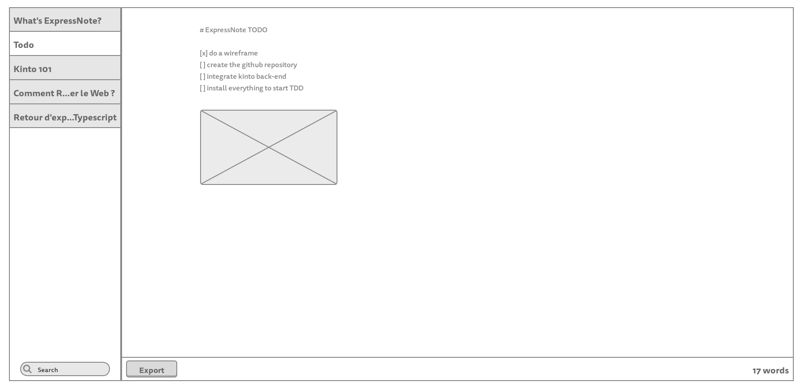

ExpressNote
===========

Gonna do something like that with Kinto as the back-end.

Feel free to add issues to fill the backlog.



# notes

GET /buckets/expressnote/collections/notes/records

```
{
  "data": [
    {
      "id": "somerealsmartid",
      "last_modified": 1457023256663,
      "created_at": 1457023256663,
      "title": "My first note",
      "content": [
        "hello John Doe",
        "# some title",
        "- a bullet item ;",
        "- another bullet"
      ]
    }
  ]
}
```
